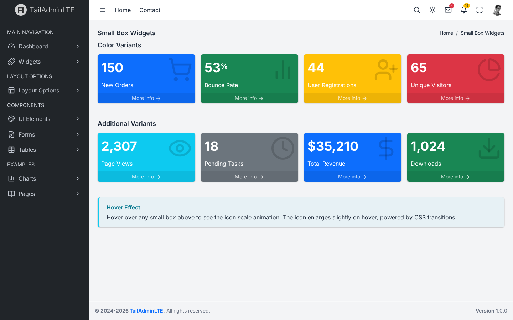
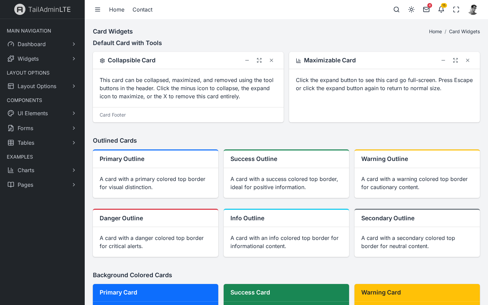
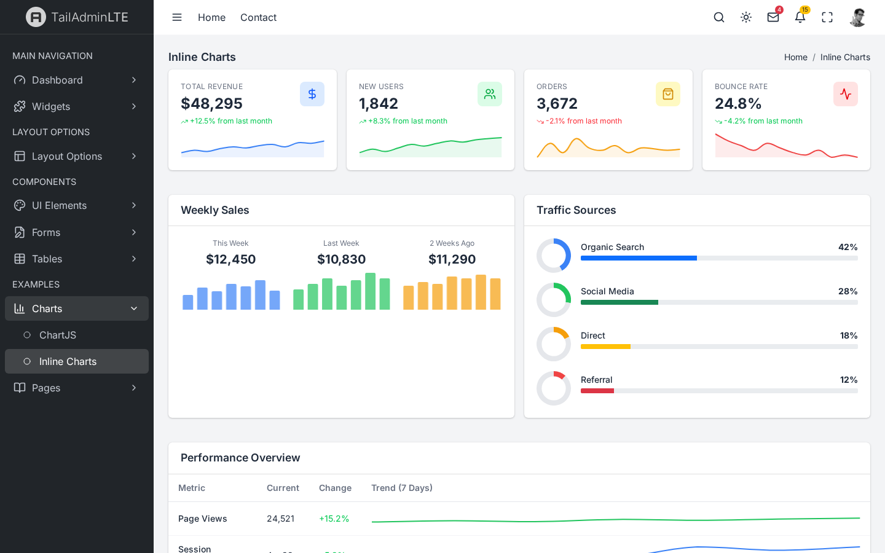
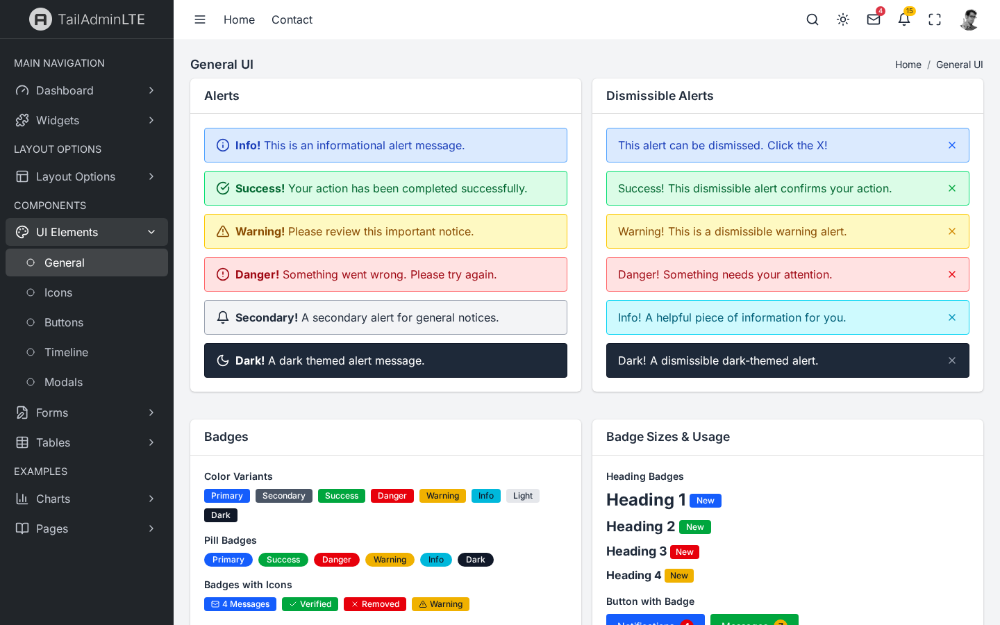
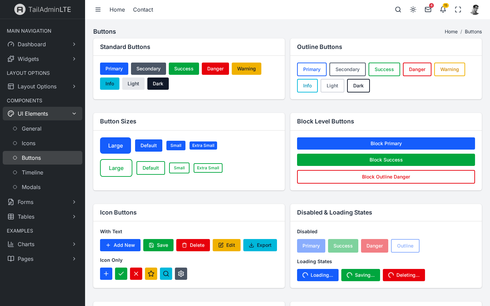
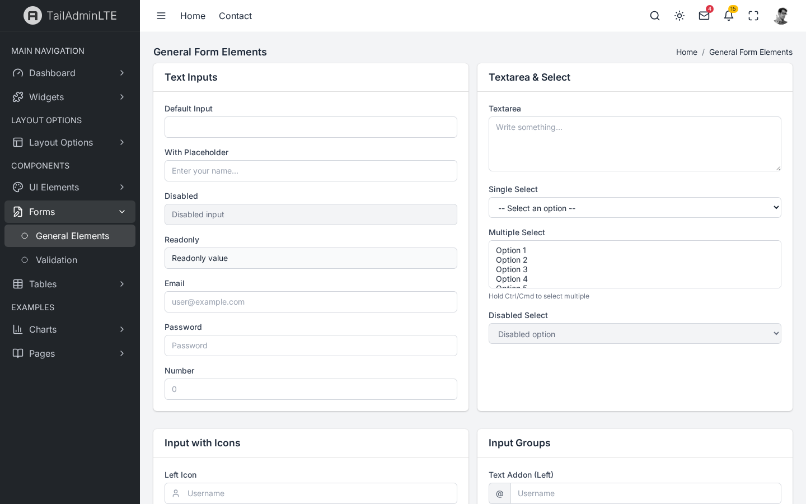
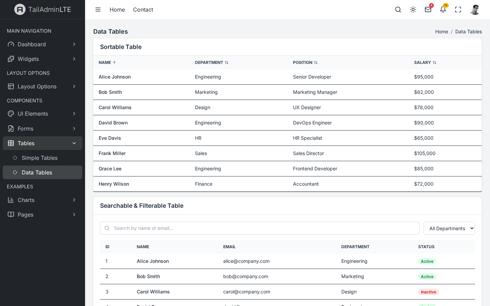
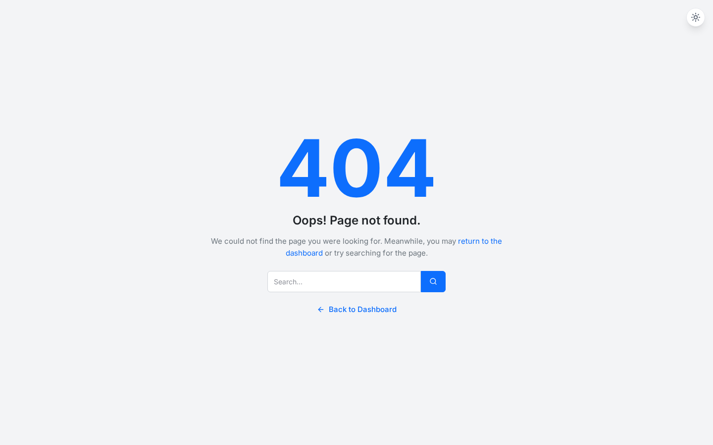
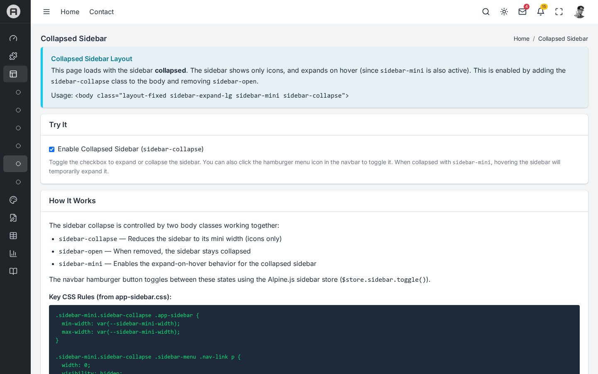

# TailAdminLTE

**AdminLTE v4 reimagined with Tailwind CSS** — A free, open-source admin dashboard template built from the ground up using modern frontend technologies.

<p align="center">
  
</p>

<p align="center">
  <a href="#features">Features</a> &bull;
  <a href="#screenshots">Screenshots</a> &bull;
  <a href="#quick-start">Quick Start</a> &bull;
  <a href="#tech-stack">Tech Stack</a> &bull;
  <a href="#project-structure">Project Structure</a> &bull;
  <a href="#pages">Pages</a> &bull;
  <a href="#dark-mode">Dark Mode</a> &bull;
  <a href="#customization">Customization</a> &bull;
  <a href="#credits">Credits</a> &bull;
  <a href="#license">License</a>
</p>

---

## Features

- **37+ pages** — Dashboards, widgets, UI elements, forms, tables, charts, auth pages, error pages, and more
- **Tailwind CSS v4** — CSS-first configuration with custom design tokens via `@theme`
- **Alpine.js** — Lightweight reactivity for sidebar, dropdowns, dark mode, cards, and all interactive components
- **Chart.js** — Interactive, responsive charts with live dark mode color adaptation
- **Handlebars templating** — Reusable layouts and partials for consistent page structure
- **Dark mode** — Three modes (Light / Dark / Auto) with `localStorage` persistence and system preference detection
- **Fully responsive** — Mobile-first design with collapsible sidebar, responsive grids, and touch-friendly interactions
- **Accessible** — WCAG 2.1 AA features: skip links, ARIA labels, keyboard navigation, reduced motion support
- **Fast builds** — Vite-powered dev server with HMR and optimized production builds

---

## Screenshots

### Dashboard — Light & Dark Mode

| Light Mode | Dark Mode |
|:---:|:---:|
|  |  |

### Dashboard Variants

| Dashboard v2 | Dashboard v3 |
|:---:|:---:|
|  |  |

### Widgets

| Small Box Widgets | Card Widgets |
|:---:|:---:|
|  |  |

### Charts

| Chart.js Charts | Inline/Sparkline Charts |
|:---:|:---:|
|  |  |

### UI Elements

| General UI | Buttons |
|:---:|:---:|
|  |  |

### Forms & Tables

| Form Elements | Data Tables |
|:---:|:---:|
|  |  |

### Auth & Example Pages

| Login v1 | Login v2 | Profile |
|:---:|:---:|:---:|
|  |  |  |

| Invoice | 404 Error | Collapsed Sidebar |
|:---:|:---:|:---:|
|  |  |  |

### Mobile Responsive

<p align="center">
  
</p>

---

## Quick Start

### Prerequisites

- [Node.js](https://nodejs.org/) 18+ (LTS recommended)
- npm 9+

### Installation

```bash
# Clone the repository
git clone https://github.com/YOUR_USERNAME/tailadminlte.git
cd tailadminlte

# Install dependencies
npm install

# Start development server
npm run dev
```

Open [http://localhost:3000/pages/index.html](http://localhost:3000/pages/index.html) in your browser.

### Build for Production

```bash
npm run build
```

Output is in the `dist/` directory, ready to deploy to any static hosting service.

### Preview Production Build

```bash
npm run preview
```

---

## Tech Stack

| Technology | Version | Purpose |
|:---|:---|:---|
| [Vite](https://vitejs.dev/) | 6.x | Build tool and dev server with HMR |
| [Tailwind CSS](https://tailwindcss.com/) | v4 | CSS-first utility framework with `@theme` tokens |
| [Alpine.js](https://alpinejs.dev/) | 3.14+ | Lightweight reactivity (sidebar, dropdowns, dark mode) |
| [Handlebars](https://handlebarsjs.com/) | via vite-plugin-handlebars | HTML templating with partials |
| [Lucide Icons](https://lucide.dev/) | 0.460+ | 1500+ SVG icons |
| [Chart.js](https://www.chartjs.org/) | 4.x | Interactive data visualization |

---

## Project Structure

```
src/
├── css/
│   ├── app.css                   # Tailwind v4 entry + @theme design tokens
│   ├── layout/                   # Grid layout: header, sidebar, main, footer
│   ├── components/               # Widget CSS: cards, small-box, info-box,
│   │                             #   direct-chat, timeline, callout, toast, progress
│   └── pages/                    # Page-specific CSS: auth, lockscreen
├── js/
│   ├── app.js                    # Alpine.js init, store/component registration
│   ├── stores/                   # Alpine stores: sidebar, darkMode, layout, accessibility
│   ├── components/               # Alpine data: treeview, cardWidget, directChat,
│   │                             #   todoList, fullscreen
│   └── utils/                    # slideToggle animation utility
├── layouts/                      # Handlebars layouts: default, auth, error, blank
├── partials/
│   ├── head.html                 # <head> meta, CSS imports
│   ├── scripts.html              # Bottom scripts
│   ├── header/                   # Navbar, search, dropdowns, user menu, dark mode toggle
│   ├── sidebar/                  # Sidebar brand, navigation menu, overlay
│   ├── footer/                   # Footer content
│   ├── content/                  # Breadcrumb, content header
│   ├── widgets/                  # Reusable widget partials
│   └── ui/                       # Alert, modal, toast, callout, dark-mode-toggle
├── pages/                        # All HTML pages (Vite multi-page entry points)
│   ├── index.html                # Dashboard v1
│   ├── index2.html               # Dashboard v2
│   ├── index3.html               # Dashboard v3
│   ├── widgets/                  # Small box, info box, cards showcase
│   ├── layout/                   # Layout variant demos
│   ├── UI/                       # General, icons, timeline, buttons, modals
│   ├── forms/                    # General elements, validation
│   ├── tables/                   # Simple tables, data tables
│   ├── charts/                   # Chart.js, inline sparklines
│   └── examples/                 # Auth, error, profile, invoice, gallery, etc.
└── data/
    └── navigation.json           # Sidebar menu structure (data-driven)
```

---

## Pages

### Dashboards (3)
- **Dashboard v1** — Sales chart, direct chat, visitor stats, small boxes, info boxes
- **Dashboard v2** — Revenue/expense line chart, monthly bar chart, orders table, goal completion
- **Dashboard v3** — Doughnut chart, todo list, activity timeline, system metrics

### Widgets (3)
- Small Box showcase (all color variants)
- Info Box showcase (with/without progress bars)
- Cards showcase (outlined, colored, tabbed, collapsed, loading, direct chat)

### UI Elements (5)
- **General** — Alerts, badges, callouts, tooltips, progress bars, spinners, dropdowns, pagination, list groups, accordion
- **Icons** — Searchable Lucide icons grid (80+ icons)
- **Timeline** — Vertical timeline with colored markers and mixed content
- **Buttons** — Solid, outline, sizes, groups, gradients, icon buttons, loading states
- **Modals** — Default, sized, scrollable, centered, colored, form, and confirmation modals

### Forms (2)
- **General** — All input types, input groups, floating labels, checkboxes, radios, selects, horizontal/inline layouts
- **Validation** — HTML5 validation, Alpine.js real-time validation, password strength indicator

### Tables (2)
- **Simple** — Striped, bordered, hover, responsive, dark, colored, with actions
- **Data Tables** — Alpine.js-powered sorting, searching, filtering, and pagination

### Charts (2)
- **Chart.js** — Line, bar, horizontal bar, doughnut, pie, radar, polar area, mixed charts
- **Inline** — Sparkline stat cards, mini bar charts, mini doughnuts, trend lines, CSS-only charts

### Layout Variants (6)
- Fixed sidebar, fixed header, fixed footer, collapsed sidebar, sidebar mini, logo switch
- Each with interactive toggles and explanation

### Auth & Error Pages (7)
- Login v1 (centered card), Login v2 (split layout with panel)
- Register v1, Register v2
- Lockscreen (live clock, avatar)
- 404 Error, 500 Error

### Example Pages (7)
- User Profile (tabs, activity timeline, settings)
- Invoice (printable, line items table)
- Image Gallery (filterable, lightbox)
- Search Results (tabbed: all, images, news)
- Projects (cards/list view, status filters)
- Contacts (card grid with actions)
- E-Commerce (product cards, filters, sort)

---

## Dark Mode

TailAdminLTE supports three dark mode states:

| Mode | Behavior |
|:---|:---|
| **Light** | Always light theme (default) |
| **Dark** | Always dark theme |
| **Auto** | Follows system `prefers-color-scheme` preference |

Toggle via the sun/moon icon in the navbar. The preference is persisted to `localStorage` and applied instantly. All Chart.js charts reactively update their grid lines, labels, and borders when switching themes.

### Implementation

Dark mode is powered by a class-based strategy:

```css
/* Tailwind v4 custom variant */
@custom-variant dark (&:where(.dark, .dark *));
```

The `darkMode` Alpine store toggles the `dark` class on `<html>` and persists the choice:

```js
// Toggle: light → dark → auto → light
$store.darkMode.toggle()

// Set directly
$store.darkMode.setMode('dark')
```

---

## Layout System

The layout uses CSS Grid matching AdminLTE v4's structure:

```css
.app-wrapper {
  display: grid;
  grid-template-areas: "sidebar header" "sidebar main" "sidebar footer";
  grid-template-rows: min-content 1fr min-content;
  grid-template-columns: auto 1fr;
  min-height: 100vh;
}
```

### Responsive Behavior

| Breakpoint | Sidebar | Header |
|:---|:---|:---|
| < 992px (mobile) | Off-screen overlay, toggle via hamburger | Full width |
| >= 992px (desktop) | Visible, part of grid | Shares row with sidebar |
| Mini mode | Icon-only, expands on hover | Full width content |

---

## Customization

### Design Tokens

All design tokens live in `src/css/app.css` via Tailwind v4's `@theme`:

```css
@theme {
  --color-primary: #0d6efd;
  --color-success: #198754;
  --color-warning: #ffc107;
  --color-danger: #dc3545;
  --sidebar-width: 250px;
  --header-height: 3.5rem;
  --transition-speed: 300ms;
  --shadow-card: 0 0 1px rgba(0,0,0,0.125), 0 1px 3px rgba(0,0,0,0.2);
  /* ... */
}
```

Change any token and it propagates globally.

### Adding a New Page

1. Create `src/pages/your-page.html`:

```html
<!doctype html>
<html lang="en">
<head>
  {{> head title="TailAdminLTE | Your Page"}}
</head>
<body class="layout-fixed sidebar-expand-lg sidebar-mini sidebar-open bg-gray-100 dark:bg-gray-900 font-sans text-gray-800 dark:text-gray-200" x-data>
  <div class="app-wrapper">
    {{> header/navbar}}
    {{> sidebar/sidebar activePage="your-page"}}
    <main class="app-main">
      {{> content/content-header pageTitle="Your Page"}}
      <div class="app-content">
        <div class="w-full px-4">
          <!-- Your content here -->
        </div>
      </div>
    </main>
    {{> footer/footer}}
  </div>
  {{> scripts}}
</body>
</html>
```

2. Vite auto-discovers it — no config changes needed.

For pages in subdirectories (e.g., `src/pages/custom/page.html`), add `pathPrefix="../.."` to the `head` and `scripts` partials:

```html
{{> head title="..." pathPrefix="../.."}}
{{> scripts pathPrefix="../.."}}
```

---

## Alpine.js Architecture

### Stores (Global State)

| Store | Purpose |
|:---|:---|
| `sidebar` | Open/close/mini toggle, responsive breakpoint handling |
| `darkMode` | Light/dark/auto with localStorage persistence |
| `layout` | Hold-transition during resize, app-loaded state |
| `accessibility` | WCAG features, font size, high contrast, reduced motion |

### Components (Per-Element)

| Component | Purpose |
|:---|:---|
| `treeview` | Nested menu expand/collapse with accordion mode |
| `cardWidget` | Card collapse/expand/remove/maximize |
| `directChat` | Chat contacts pane toggle |
| `todoList` | Todo management with filtering |
| `fullscreen` | Fullscreen API toggle with state tracking |

---

## Browser Support

- Chrome / Edge (last 2 versions)
- Firefox (last 2 versions)
- Safari (last 2 versions)
- Mobile Safari / Chrome (iOS & Android)

---

## Credits

TailAdminLTE is a **community recreation** of [AdminLTE](https://adminlte.io/) using Tailwind CSS. This project would not exist without the incredible work of the AdminLTE team.

### AdminLTE

- **Original project:** [AdminLTE v4](https://github.com/ColorlibHQ/AdminLTE) by [ColorlibHQ](https://github.com/ColorlibHQ)
- **Website:** [https://adminlte.io](https://adminlte.io)
- **Live Demo:** [https://adminlte.io/themes/v4/](https://adminlte.io/themes/v4/)
- **License:** MIT

AdminLTE is one of the most popular open-source admin dashboard templates, with 45k+ GitHub stars. It has been the go-to choice for developers building admin panels since 2013. TailAdminLTE aims to bring that same comprehensive component set to the Tailwind CSS ecosystem.

### Technologies

- [Tailwind CSS](https://tailwindcss.com/) by Adam Wathan & the Tailwind Labs team
- [Alpine.js](https://alpinejs.dev/) by Caleb Porzio
- [Vite](https://vitejs.dev/) by Evan You & the Vite team
- [Chart.js](https://www.chartjs.org/) by the Chart.js contributors
- [Lucide Icons](https://lucide.dev/) by the Lucide community
- [Handlebars](https://handlebarsjs.com/) by Yehuda Katz
- [Inter font](https://rsms.me/inter/) by Rasmus Andersson

### Disclaimer

TailAdminLTE is an **independent project** and is not officially affiliated with or endorsed by AdminLTE or ColorlibHQ. The original AdminLTE design, layout concepts, and page structure are the intellectual property of their respective creators. This project recreates similar functionality using different underlying technologies (Tailwind CSS instead of Bootstrap) as a learning resource and alternative implementation.

---

## Contributing

Contributions are welcome! Please feel free to submit a Pull Request.

1. Fork the repository
2. Create your feature branch (`git checkout -b feature/amazing-feature`)
3. Commit your changes (`git commit -m 'Add amazing feature'`)
4. Push to the branch (`git push origin feature/amazing-feature`)
5. Open a Pull Request

---

## License

This project is licensed under the MIT License — see the [LICENSE](LICENSE) file for details.

The original AdminLTE is also licensed under [MIT](https://github.com/ColorlibHQ/AdminLTE/blob/master/LICENSE).
